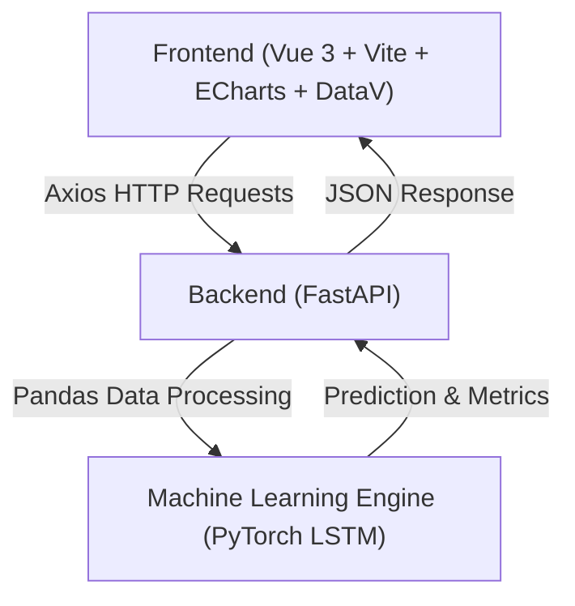
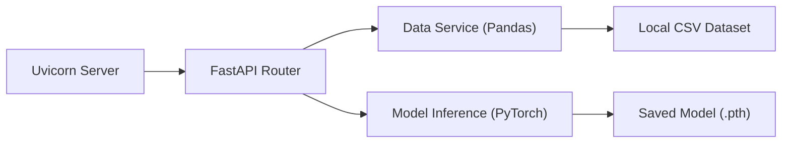

## 1. 架构设计


## 2. 技术说明
- **Frontend (核心发力点)**: Vue 3 (Composition API) + Vite + ECharts + `@dataview/datav-vue3` + Axios。
- **Backend (轻量即可)**: Python + FastAPI + Uvicorn。
- **Algorithm (算法有就行)**: PyTorch (跑一个简单的单层 LSTM 模型) + Scikit-learn (预处理与指标评估)。
- **Data (数据集)**: 使用已有的 `traffic volume.csv` 提取时间戳和车流量。

## 3. 路由定义 (前端)
| 路由 | 目的 |
|-------|---------|
| `/` | 大屏主页，集成所有图表组件和动态特效 |

## 4. API 定义 (后端)

### 4.1 `/api/history`
- **Method**: GET
- **Purpose**: 返回过去 24 小时（或其他历史时间段）的真实交通流量数据。
- **Response**:
  ```json
  {
    "timestamps": ["2012-10-02 09:00:00", "..."],
    "flow": [5545, "..."]
  }
  ```

### 4.2 `/api/predict`
- **Method**: GET
- **Purpose**: 加载已训练好的 PyTorch LSTM 模型（`traffic_model.pth`），根据最新输入数据返回未来几小时的预测流量。
- **Response**:
  ```json
  {
    "timestamps": ["2012-10-03 09:00:00", "..."],
    "predicted_flow": [5600, "..."],
    "metrics": {
      "rmse": 120.5,
      "mae": 85.2,
      "confidence": 92.5
    }
  }
  ```

## 5. 服务器架构图


## 6. 数据模型 (暂无复杂数据库)
- 数据源：CSV 文件中的 `Time`（时间戳）和 `traffic_volume`（车流量）。
- 模型输入格式：过去 $T$ 个时间步的流量序列（形状为 `[Batch, Sequence_Length, Features]`）。
- 模型输出格式：未来 $N$ 个时间步的流量预测值。
