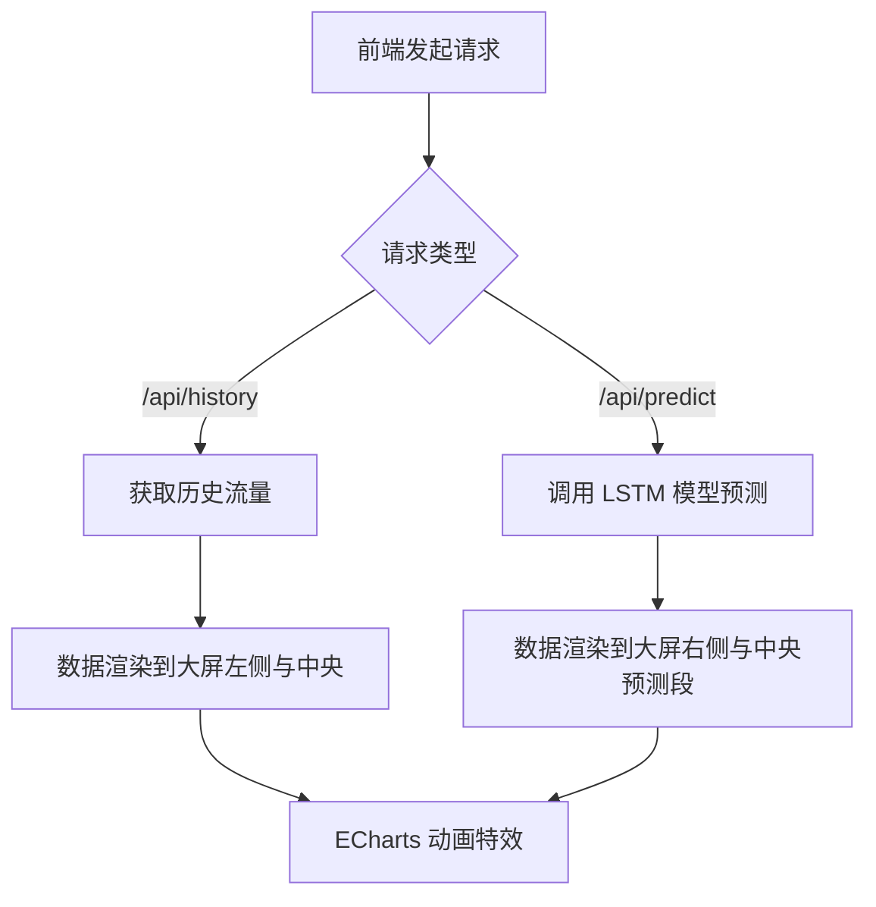

## 1. 产品概述
城市交通流量智能时序预测系统是一个极具科技感的数据大屏应用。
- 核心目的是将交通路网的公开数据集（如车流量和时间戳）进行时序分析和预测，并通过高颜值的深色系可视化界面展示给用户。
- 目标用户是交通管理部门、数据分析师或项目汇报评委，展现出“高端、专业、有深度”的技术实力。

## 2. 核心功能

### 2.1 用户角色
| 角色 | 注册方式 | 核心权限 |
|------|---------------------|------------------|
| 访客 | 无需注册 | 浏览交通大屏，查看历史流量统计与预测数据 |

### 2.2 功能模块
1. **交通流量历史统计模块**：通过左侧面板柱状图、饼图展示历史车流量分布规律。
2. **模型评估指标模块**：通过右侧面板展示均方误差(RMSE)、平均绝对误差(MAE)，并通过 DataV 环形进度条展示“预测置信度”。
3. **时序预测核心展区**：在页面中央(C位)呈现巨大的交通流量折线图，包含真实历史数据与模型预测数据的动态对比。
4. **算法服务模块**：后端基于公开数据集训练 LSTM 模型，提供实时预测接口。

### 2.3 页面详细信息
| 页面名称 | 模块名称 | 功能描述 |
|-----------|-------------|---------------------|
| 大屏主页 | 顶栏组件 | 系统标题“城市交通流量智能时序预测系统”，附带当前时间及天气组件 |
| 大屏主页 | 左侧面板 | 历史交通流量统计分析图表 |
| 大屏主页 | 右侧面板 | 模型评估指标、预测置信度进度条 |
| 大屏主页 | 中央主区 | 基于 ECharts 的时序预测大图，包含数据加载动画特效 |

## 3. 核心流程
1. 后端加载并清洗交通流量数据集，使用过去时间窗口的数据特征训练 LSTM 时序模型。
2. 后端暴露 FastAPI 接口：`/api/history` 获取过去24小时真实数据，`/api/predict` 获取未来几小时预测数据。
3. 前端使用 Axios 发起请求，并在加载期间展示科技感 Loading 动画。
4. 接口返回数据后，前端 ECharts 折线图更新，历史数据以实线展示，预测数据以虚线展示，交汇处显示呼吸灯特效。

## 4. 用户界面设计
### 4.1 设计风格
- 主色调：深色星空黑 (`#020308`) 为背景，辅以科技蓝、青色和橙色。
- 组件风格：使用 DataV 边框及装饰组件提升科技感和“逼格”。
- 字体：采用无衬线、清晰且带有现代感的字体（如 Inter、Roboto，数字采用等宽字体如 Orbitron）。
- 布局结构：大屏经典三段式（顶部标题栏，左右两侧数据统计，中央为主图区）。

### 4.2 页面设计概览
| 页面名称 | 模块名称 | UI 元素 |
|-----------|-------------|-------------|
| 大屏主页 | 顶栏 | 科技感发光标题文本，右侧动态时间显示 |
| 大屏主页 | 左侧面板 | DataV 边框包裹的 ECharts 柱状图/饼图，青色调为主 |
| 大屏主页 | 右侧面板 | 环形进度条组件，评估指标文字高亮显示 |
| 大屏主页 | 中央主区 | 巨大的平滑折线图 (`smooth: true`)，渐变面积填充 (`areaStyle`)，青证实线+橙色虚线+闪烁发光点 (`effectScatter`) |

### 4.3 响应式设计
- 桌面端优先，适合 1920x1080 大屏展示。
- 固定比例缩放适配（通过 CSS `transform: scale` 或 DataV 全屏容器处理不同分辨率屏幕），确保布局不乱。
